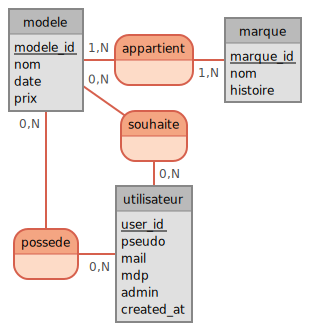

# Conception de la bdd

**modele** (<ins>modele_id</ins>, nom, date, prix)  
**appartient** (<ins>_marque_id_</ins>, <ins>_modele_id_</ins>)  
**marque** (<ins>marque_id</ins>, nom, histoire)  
**souhaite** (<ins>_user_id_</ins>, <ins>_modele_id_</ins>)  
**possede** (<ins>_user_id_</ins>, <ins>_modele_id_</ins>)  
**utilisateur** (<ins>user_id</ins>, pseudo, mail, mdp, admin, created_at)

Voir [le dictionnaire de donnée](./bdd/Modeles_data_dict.md)